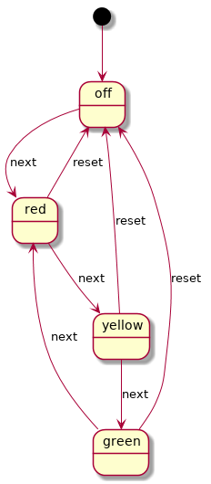

# A Reference Implementation of a State Machine

This implementation has two main features: very low latencies, and no dynamic
memory allocation. As such, it is targeted mainly at bare-metal software
running on microcontrollers.

## Defining a State Machine

For each state machine we need to specify:
- a set of states and events
- state transitions
- executable logic

Let's take a simplified traffic lights controller (TLC) as an example. States and events are defined in `fsm_tlc.h`

```
typedef enum {
    TLC_STATE_NULL,
    TLC_STATE_OFF,
    TLC_STATE_RED,
    TLC_STATE_YELLOW,
    TLC_STATE_GREEN,
    TLC_NUMOF_STATES
} fsm_tlc_state_t;

typedef enum {
    TLC_EVENT_NULL,
    TLC_EVENT_RESET,
    TLC_EVENT_NEXT,
    TLC_NUMOF_EVENTS
} fsm_tlc_event_t;
```

Executable logic is defined in functions in `fsm_tlc_actions.c`:
```
void tlc_red_on_entry(void)
{
    puts("Red light on");
}

void tlc_red_on_exit(void)
{
    puts("Red light off");
}
[...]
```

And the whole state machine is integrated in a state transition table (`fsm_tlc.c`):
```
static fsm_state_t
tlc_tx_table [TLC_NUMOF_STATES] = {
    [TLC_STATE_OFF] = {
        .id = TLC_STATE_OFF,
        .transitions = {
            [TLC_EVENT_NEXT] = TLC_STATE_RED,
        },
        .on_entry = tlc_off_on_entry,
        .on_exit  = tlc_off_on_exit,
        .on_tick  = tlc_off_on_tick,
    },
    [TLC_STATE_RED] = {
        .id = TLC_STATE_RED,
        .transitions = {
            [TLC_EVENT_NEXT] = TLC_STATE_YELLOW,
            [TLC_EVENT_RESET] = TLC_STATE_OFF,
        },
        .on_entry = tlc_red_on_entry,
        .on_exit  = tlc_red_on_exit,
        .on_tick  = tlc_red_on_tick,
    },
    [TLC_STATE_YELLOW] = {
        .id = TLC_STATE_YELLOW,
        .transitions = {
            [TLC_EVENT_NEXT] = TLC_STATE_GREEN,
            [TLC_EVENT_RESET] = TLC_STATE_OFF,
        },
        .on_entry = tlc_yellow_on_entry,
        .on_exit  = tlc_yellow_on_exit,
        .on_tick  = tlc_yellow_on_tick,
    },
    [TLC_STATE_GREEN] = {
        .id = TLC_STATE_GREEN,
        .transitions = {
            [TLC_EVENT_NEXT] = TLC_STATE_RED,
            [TLC_EVENT_RESET] = TLC_STATE_OFF,
        },
        .on_entry = tlc_green_on_entry,
        .on_exit  = tlc_green_on_exit,
        .on_tick  = tlc_green_on_tick,
    },
};
```

## State Machine Engine
There is a single "engine" (`fsm.c`), responsible for checking events, performing state transitions, and executing actions associated with states and transitions. It has pretty much two important functions:
- `fsm_tick` to keep a state machine running
- `fsm_send_event` to trigger transitions

So in a typical program we run state machines in a loop, and send events to them from various places.
```
while (1) {
    fsm_tick(fsm_tlc);
    fsm_tick(fsm_foo);
    fsm_tick(fsm_bar);
}

// Somewhere else in the program
fsm_send_event(fsm_bar, BAR_EVENT_X);
fsm_send_event(fsm_foo, FOO_EVENT_RESET);

// Somewhere else:
fsm_send_event(fsm_tlc, TLC_EVENT_NEXT);

```


## Automating FSM creation process

After implementing a few state machines, it becomes tedious to manually write
FSM files, always following the same pattern. So a script for [GSL
generator](https://github.com/zeromq/gsl) is provided. It allows to specify
states, events, and transitions in an xml file:

```
<?xml version = "1.0" ?>
<fsm
    name        = "Traffic Lights Controller"
    abbr        = "tlc"
    script      = "fsm.gsl"
    first_state = "off"
>

<events>
    <event name = "reset" />
    <event name = "next" />
</events>

<states>
    <state name = "off">
        <transition event = "next"  new_state = "red" />
    </state>

    <state name = "red">
        <transition event = "next"  new_state = "yellow" />
        <transition event = "reset" new_state = "off" />
    </state>

    <state name = "yellow">
        <transition event = "next"  new_state = "green" />
        <transition event = "reset" new_state = "off" />
    </state>

    <state name = "green">
        <transition event = "next"  new_state = "red" />
        <transition event = "reset" new_state = "off" />
    </state>
</states>

</fsm>
```

Having the state machine specified as an GSL model, allows to automatically generate code which implements states, events, and the transition table, as well as the template of functions associated with each state.
```
> gsl -script:fsmgen.gsl fsm_tlc.xml
```

We can also generate a [plantUML](http://plantuml.com/state-diagram) diagram:
```
> gsl -script:fsm_diagram.gsl fsm_tlc.xml
```



_Note: You may notice that the XML model describing the state machine for GSL generator resembles [SCXML](https://en.wikipedia.org/wiki/SCXML) specification very closely. This is pure coincidence; I made this implementation before I learned about SCXML._


